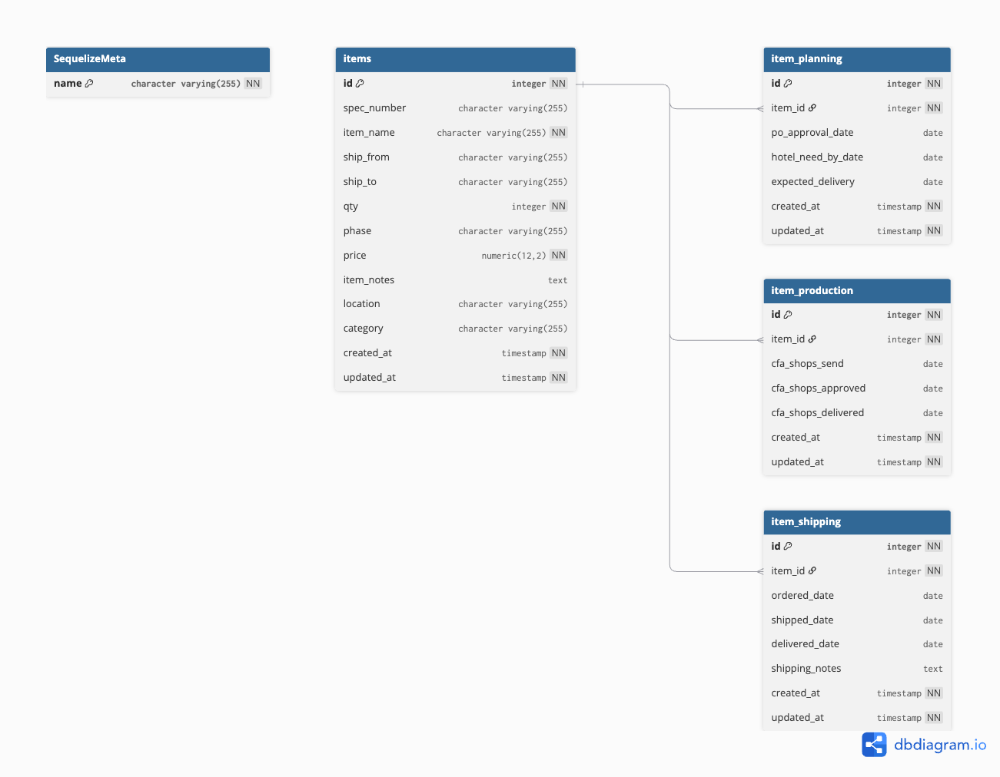
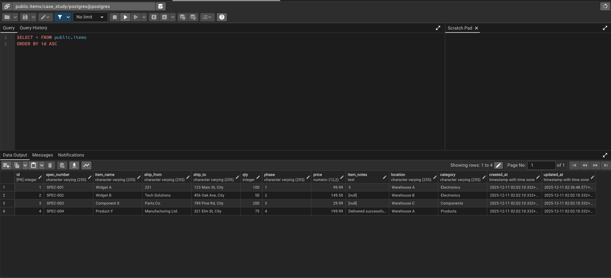
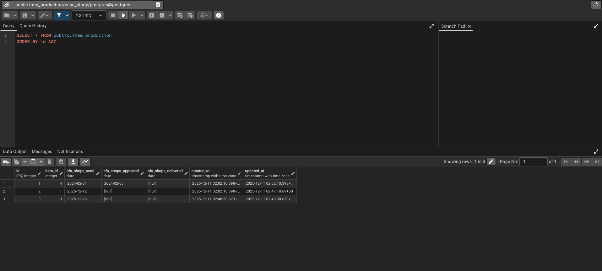
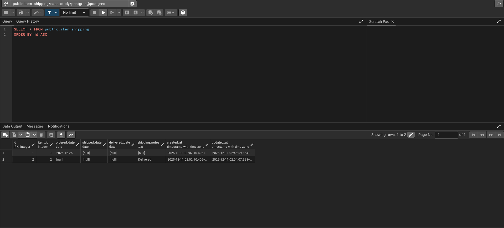

# Case Study Backend (NestJS + PostgreSQL)

Backend for an item lifecycle case study built with NestJS, Sequelize, and PostgreSQL. The codebase follows a domain-driven layout and models the flow of items through planning, production, and shipping, with orchestration for bulk operations.

## What’s inside
- **Domain modules:** `items` domain with four services/models: Items (core), Planning, Production, and Shipping. Each table is relational and indexed for frequent filters (e.g., `location`, `ship_from`, `phase`, `expected_delivery`).
- **Orchestration:** `src/items/services/item-orchestrator.service.ts` handles cross-cutting workflows such as bulk updates and synchronized tracking updates across planning/production/shipping.
- **Interfaces:** Shared DTO/response types live under `src/items/interfaces`.
- **Data layer:** Sequelize + Postgres, migrations and seeders under `src/database` (see `.sequelizerc` for paths).
- **API docs:** Swagger is available at `/api-docs` when the app is running; health check at `/health`.
- **Docker-ready:** Multi-stage `Dockerfile` plus `docker-compose.yml` for app + Postgres.

## Project layout
- `src/items/models`: Sequelize models for items, planning, production, shipping (1–1 relations to an item).
- `src/items/services`: Core CRUD services plus the orchestrator for bulk actions and phase transitions.
- `src/database/migrations`, `src/database/seeders`: Sequelize CLI migrations/seed data (referenced by `.sequelizerc`).
- `src/database/config`: Runtime config (`database.config.ts`) and CLI config (`config.js`, `cli-config.js`).

## Getting started (local)
1) Install Node.js 20+ and PostgreSQL 16 (or use Docker Compose below).  
2) Create an `.env` file (defaults shown):
   ```env
   DB_HOST=localhost
   DB_PORT=5432
   DB_DATABASE=case_study
   DB_USERNAME=postgres
   DB_PASSWORD=postgres
   PORT=3000
   NODE_ENV=development
   ```
3) Install deps and run:
   ```bash
   npm install
   npm run start:dev
   ```
4) Open Swagger UI at http://localhost:3000/api-docs.

## Database, migrations, seeders
Sequelize CLI is wired via `.sequelizerc` to `src/database`:
- Run migrations: `npm run migration:run`
- Undo last migration: `npm run migration:undo`
- Seed sample data: `npm run seed`
- Reset database (undo all + re-run + seed): `npm run db:reset`
- Generate a migration: `npm run migration:generate -- --name add-new-table`

Migrations live in `src/database/migrations` and seeders in `src/database/seeders`.

## Docker
- Build the production image (multi-stage):  
  `docker build -t case-study-backend .`
- Run app + Postgres:  
  `docker compose up --build`
- After containers are healthy, apply migrations/seed inside the app container if needed:  
  `docker compose exec app npm run migration:run && npm run seed`

## API notes
- Base URL: `http://localhost:3000`
- Common endpoints: `GET /items`, `GET /items/:id`, `PATCH /items/:id/planning`, `/production`, `/shipping`
- Bulk workflows (via orchestrator): `POST /items/bulk-update` and `POST /items/bulk-tracking` (names from controller), enabling mass updates and synchronized tracking changes.
- Auth: Swagger is prepared for bearer auth; adjust according to your deployment needs.

## Database schema
- Schema link: https://dbdiagram.io/d/693a90f8e877c630746ceacd
- Schema images:
  - Diagram: 
  - Items: 
  - Production: 
  - Shipping: 
  - Planning: 

